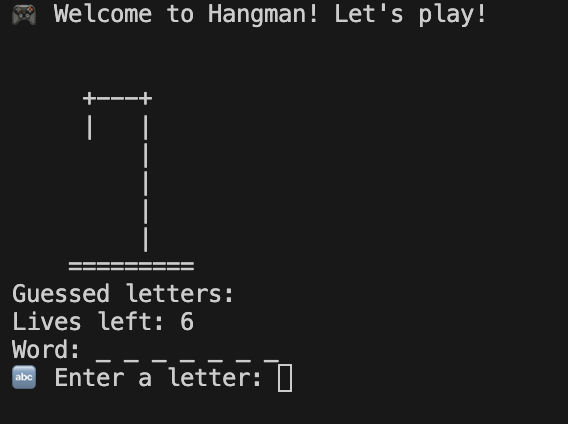

# hangman

# 🎮 Hangman Game

Welcome to **Hangman**, the classic word-guessing game built in **Python**! This version is designed to run right in your terminal with cool text-based visuals and emojis.

---

## 📝 Description

This is a simple Hangman game written in **pure Python** that runs in the terminal. A word is chosen at random, and you must guess the letters one at a time before the stickman is fully drawn!

---

## 🎯 Features

- Random word selection
- Fun ASCII stickman drawings
- Easy-to-follow terminal interface
- Stylish emojis and text formatting
- No external libraries needed

---

## ▶️ How to Run

1. Download or clone the repository.
2. Open the folder in your terminal or VS Code.
3. Run the game with:
python hangman.py

## Screenshots

